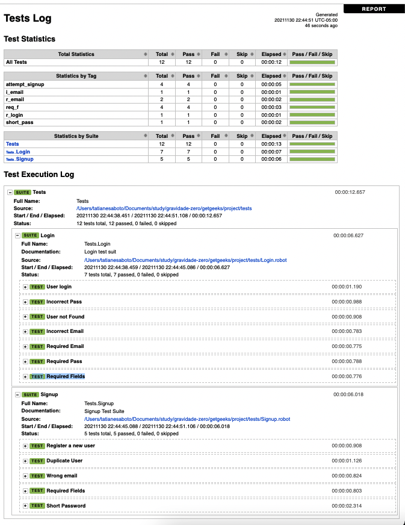

# Automation Test - Zero Gravity Course 
The purpose of this project is to automate the site [Get Geeks!](https://getgeeks-tsaboto.herokuapp.com/)using the techniques learned in the course, with  frameworks and libraries describe below: 

-  [RobotFramework](https://cucumber.io/)
-  [Browser Library](https://github.com/MarketSquare/robotframework-browser)
-  [Python](https://www.python.org/)


## Getting Started
### Prerequisites

- [Python @3.9.7](https://www.ruby-lang.org/en/news/2020/10/02/ruby-2-7-2-released/)

## Installation
The steps below describe how to install all dependecy for macOS

```bash
$ brew install python3
```

```bash
pip3 install robotframework
```

```bash
pip3 install robotframework-browser
```

## Running the tests
After the installation and configuration of the environment, access the end in the path of the folder where the file was downloaded

```bash
./Run.bat on Windows. or ./Run.sh on Linux ou MAC.
```

## Test report

For easier understanding of the result and better visibility of the tests, the script will generate a final report at the end of each execution.

Example of report:
